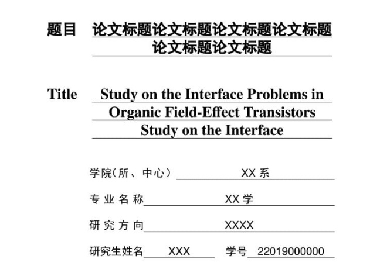
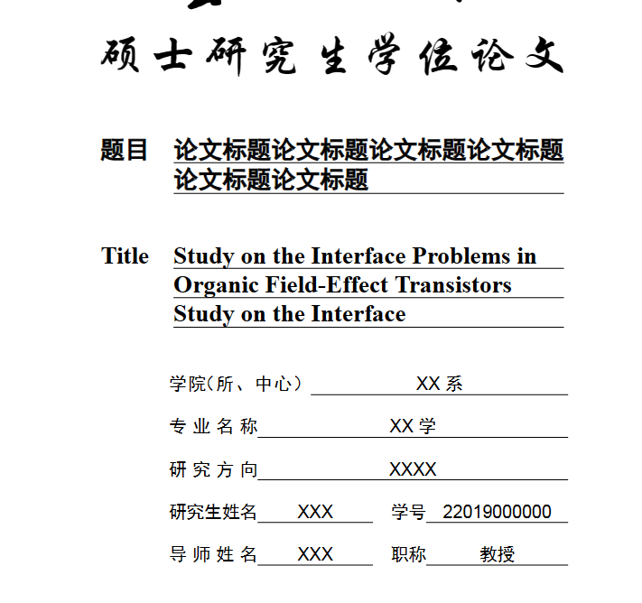

# 云南大学研究生学位论文 LaTeX 模板


## 原大佬在这里

- [Astro-Lee/YNUthesis: LaTeX thesis template for Yunnan University (github.com)](https://github.com/Astro-Lee/YNUthesis)

    

## 修改说明 

- **原模板**封面的**标题**是`居中对齐`, **研究生院**发的通知为`左对齐`
- 封面有两种生成方式, `导入pdf`和 `使用命令生成`
- 如果**封面**使用**居中对齐**的方式, 请转到[Astro-Lee/YNUthesis: LaTeX thesis template for Yunnan University (github.com)](https://github.com/Astro-Lee/YNUthesis)
- ~~增加**答辩PPT模板**，解压`zip`文件，编译器使用`Xelatex`, 主文档是`ppt.tex`, 修改自[Presentation Data Science LM-DATA UNICT - Overleaf, Online LaTeX Editor](https://www.overleaf.com/latex/templates/presentation-data-science-lm-data-unict/gfqjwvrwsghp)~~已经废弃, 不好用, 不如直接用ppt


#### 修改1 封面居中

**修改前**



**修改后**




#### 修改2 页眉问题

原本只有空白页


- 原本只有空白页, 修改后空白页加上了页眉


[](https://github.com/Astro-Lee/YNUthesis/actions/workflows/Compiling%20LaTeX%20template.yml)

- 本模板正处于开发阶段。

- 本模板根据[《云南大学研究生学位论文写作规范》](http://www.grs.ynu.edu.cn/info/1037/1540.htm)编写，**个人能力、精力有限，不保证完全符合规范！此外，该模板未经学校官方核准，如有顾虑，请不要使用！**

- [Overleaf](https://cn.overleaf.com/latex/templates?q=%E4%BA%91%E5%8D%97%E5%A4%A7%E5%AD%A6)


## 模板使用方式如下

### 方式一(默认, 使用命令):

- 说明: 使用`latex`生成封面和扉页
- `main.tex`中进行设置 `auto-make-cover = true`


### 方式二(  导入pdf )

- 说明: 通过导入`pdf`来生成**封面和扉页**

- 首先, 修改 `fengmian.docx`,并导出为 `fengmian.pdf`

- 其次, `main.tex`中进行设置 `auto-make-cover = false`

- 最后, 修改`main.tex`中, 取消注释以下代码

- ```tex
    % 导入封面
    % 封面在 fengmian.doc中
    % % 需要导出为pdf, 且pdf名字为 fengmian.pdf
    % \includepdf{fengmian.pdf}
    
    
    % % 导入扉页1
    % \includepdf{feiye1.pdf}
    
    
    % % 导入扉页2
    % \includepdf{feiye2.pdf}
    ```

    


## 注意:

# 贡献

用户若有建议或需求，欢迎提交 [issues](https://github.com/Astro-Lee/YNUthesis/issues)、[pull requests](https://github.com/Astro-Lee/YNUthesis/pulls) 或 [discussions](https://github.com/Astro-Lee/YNUthesis/discussions)。

## Star History

[](https://star-history.com/#Astro-Lee/YNU-thesis-bachelor&Astro-Lee/YNUthesis&Date)

# 致谢
- [stone-zeng/fduthesis](https://github.com/stone-zeng/fduthesis)
---
- Email: liruizhi0871[AT]gmail.com
- Copyright (C) 2023 by Rui-Zhi Li.
